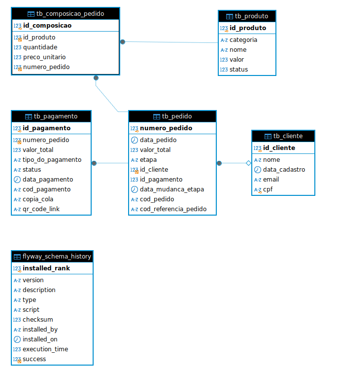

# shogun-terraform-database
Repositório que cria a estrutura do banco de dados da aplicação shogun lanches.

# Especificações
- O banco de dados utilizado para o projeto foi o modelo relacional, sendo o **MySQL** na versão **8.0.37**.
- O banco de dados é provisionado por meio do Terraform, utilizando o serviço RDS da AWS.
- O controle de versionamento do banco será por meio de *migrations* utilizando a ferramenta **FlyWay**, no caso as migrações estão no repositório da aplicação [shogun-lanches](https://github.com/6SOATGROUP74/shogun-lanches-challenge/tree/main/src/main/resources/db/migration).
- A motivação da escolha pelo modelo relacional, deve-se ao fato da priorização da consistência, integridade dos dados
e principalmente pelo controle de segurança transacional que o modelo proporciona, seguindo o princípio ACID. 
No âmbito da modelagem, pela natureza do projeto, o grupo foi capaz de definir o esquema previamente, antes mesmo do desenvolvimento da aplicação, as dinâmicas do Event Storm aplicadas na fase 1 foi de grande valia.
 
# Diagrama Entidade Relacionamento do banco de dados
